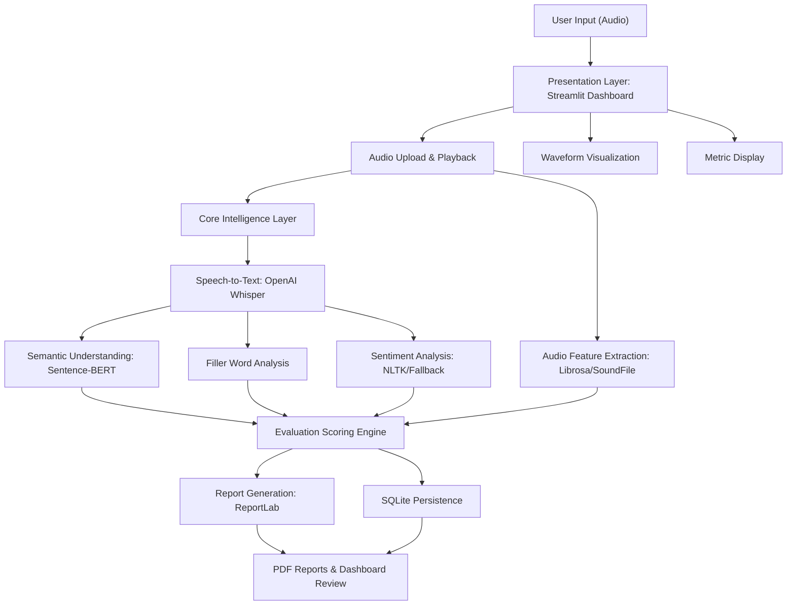
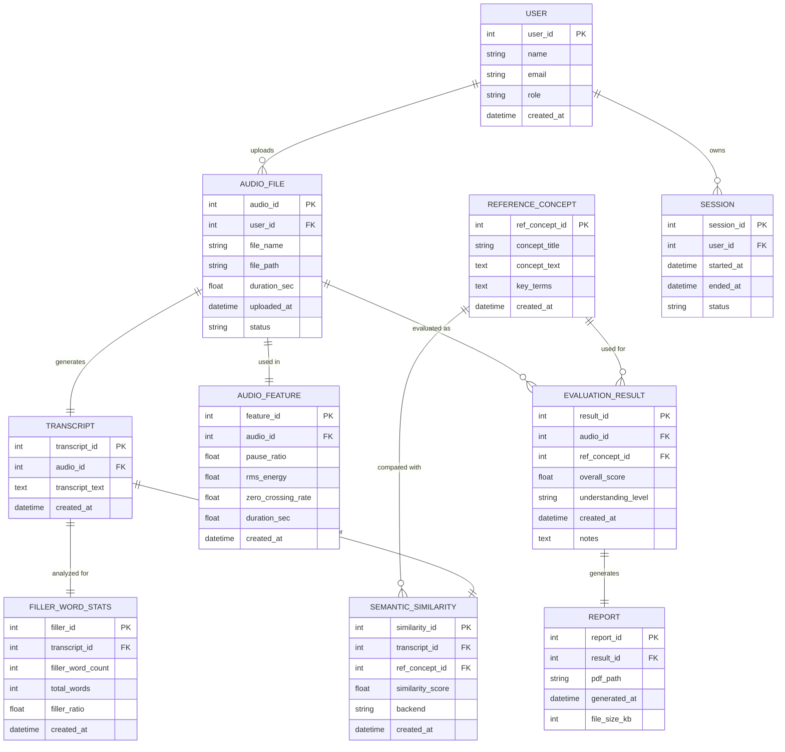

# Voice-Based Concept Understanding Analyser (VBCUA)

VBCUA is an AI-powered Streamlit application for evaluating spoken conceptual explanations. It combines speech-to-text transcription, semantic similarity, audio feature extraction, scoring, persistence, and PDF reporting into one educational assessment workflow.

## Core Capabilities

- Upload and play back audio explanations.
- Transcribe speech with OpenAI Whisper, with manual transcript fallback.
- Compare explanations against reference concepts with Sentence-BERT embeddings, with lexical fallback.
- Measure filler words, pause ratio, RMS energy, duration, and zero crossing rate.
- Analyze transcript sentiment with NLTK VADER when available and a local fallback otherwise.
- Generate understanding and communication scores with qualitative feedback.
- Store sessions, transcripts, features, semantic scores, reports, and results in SQLite.
- Download structured PDF reports with metrics, waveform images, feedback, summaries, and transcripts.
- Expose a small FastAPI interface for health checks, concept metadata, and audio evaluation.

## Skills And Technologies

Python, Generative AI, Streamlit, Matplotlib, Librosa, SoundFile, Transformers, Sentence-Transformers, Torch, NLTK-style NLP analysis, sentiment-ready text analysis hooks, ReportLab PDF generation, FastAPI, SQLite, Pytest, and optional Google Gemini summaries.

## System Requirements

- Processor: Intel i3/i5 or higher
- RAM: 4 GB minimum, 8 GB recommended
- Storage: 10 GB free disk space
- Internet connection for initial dependency and model downloads
- Python 3.10+
- Windows, Linux, or macOS
- Git and GitHub
- VS Code or PyCharm

## Setup

```powershell
python -m venv .venv
.\.venv\Scripts\Activate.ps1
python -m pip install --upgrade pip
python -m pip install -r requirements.txt
```

Optional environment variables:

```powershell
$env:WHISPER_MODEL = "base"
$env:SENTENCE_MODEL = "sentence-transformers/all-MiniLM-L6-v2"
$env:GEMINI_API_KEY = "your-gemini-api-key"
```

## Run The Streamlit App

```powershell
streamlit run app.py
```

## Run The API

```powershell
uvicorn api:app --reload
```

API endpoints:

- `GET /health`
- `GET /concepts`
- `POST /evaluate`

## Project Structure

```text
.
+-- app.py
+-- api.py
+-- requirements.txt
+-- pytest.ini
+-- tests/
+-- vbcua/
    +-- audio_features.py
    +-- config.py
    +-- models.py
    +-- pipeline.py
    +-- reference_concepts.py
    +-- reporting.py
    +-- scoring.py
    +-- semantic.py
    +-- storage.py
    +-- summary.py
    +-- text_analysis.py
    +-- transcription.py
```

## Technical Architecture



## Entity Relationship Diagram



## Project Flow

1. Environment setup and dependency configuration
2. Model selection and architecture configuration
3. Speech transcription and reference concept selection
4. Semantic similarity and key-term coverage analysis
5. Audio feature extraction and filler-word analysis
6. Comprehension and communication scoring
7. SQLite persistence
8. Streamlit dashboard review
9. PDF report generation and download
10. Testing, optimization, and deployment preparation

## Epics

### Epic 1: Environment Setup And Dependency Configuration

Install Streamlit, Whisper, Sentence-Transformers, Librosa, SoundFile, NumPy, Matplotlib, ReportLab, FastAPI, and Pytest. Configure optional model and Gemini environment variables.

### Epic 2: Core Logic Development

Develop reusable modules for transcription, semantic evaluation, audio features, scoring, summaries, persistence, and report generation.

### Epic 3: Streamlit UI Implementation

Provide audio upload, playback, waveform visualization, reference concept selection, real-time analysis, feedback display, recent-result review, and PDF downloads.

### Epic 4: Testing, Optimization, And Deployment

Validate deterministic text and scoring logic with Pytest. Keep model-dependent functionality isolated behind runtime fallbacks for smoother local deployment.

## Testing

```powershell
python -m pytest
```

## Outcome

The project builds a modular Voice-Based Concept Understanding Analyser that integrates Whisper, Sentence-BERT, audio signal analysis, scoring logic, Streamlit UI, SQLite storage, FastAPI endpoints, and automated PDF reporting for spoken concept assessment.
