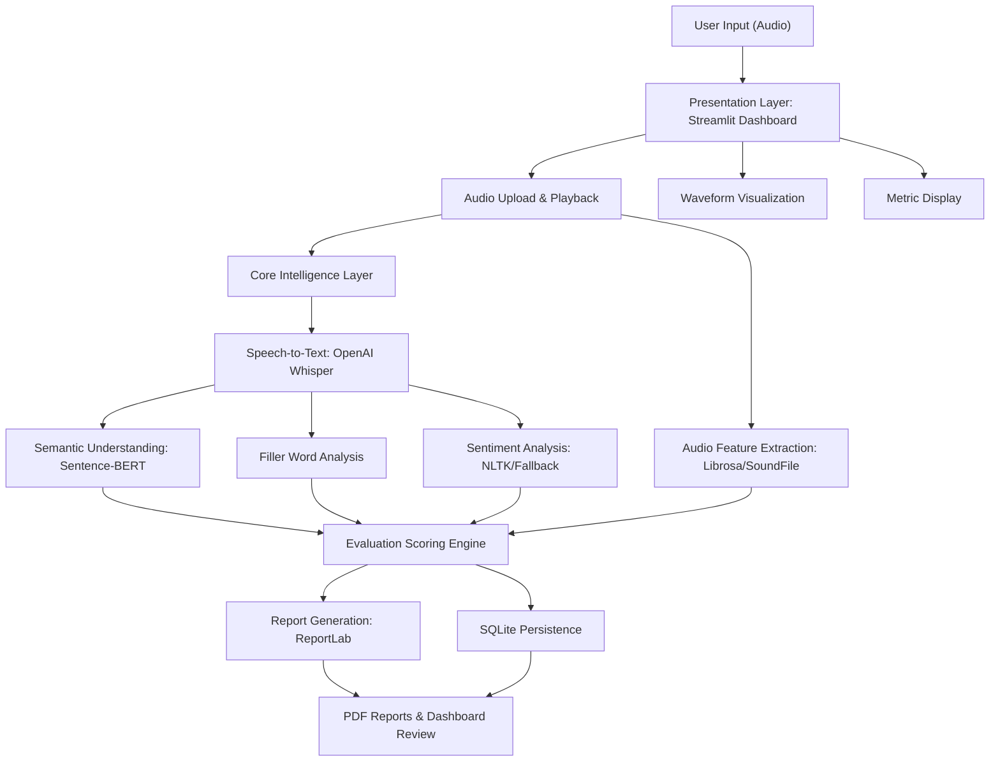
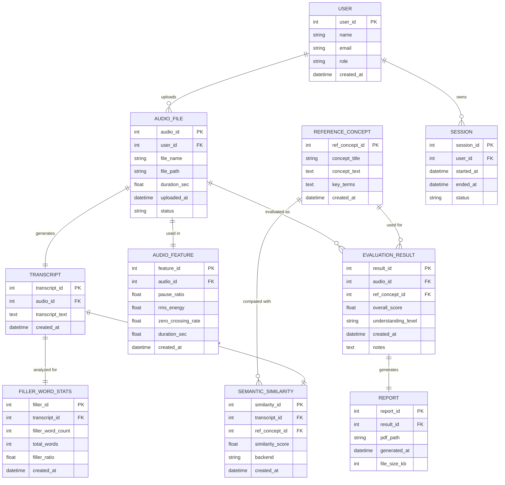

# Voice-Based Concept Understanding Analyser (VBCUA)

## Description

VBCUA is an AI-powered Streamlit application for evaluating spoken conceptual explanations. It combines speech-to-text transcription, semantic similarity analysis, audio feature extraction, sentiment analysis, scoring, persistence, and PDF reporting into one educational assessment workflow.

The application is designed for students, educators, trainers, and researchers who want to measure both conceptual understanding and spoken communication quality. A user can upload an audio explanation, compare it with a reference concept, review fluency metrics, and download a structured PDF report.

## What Is Voice-Based Concept Understanding Analysis

Voice-based concept understanding analysis is the process of evaluating how clearly a person explains a topic through speech. In this project, the spoken answer is transcribed, compared against a reference explanation, and analyzed for fluency indicators such as filler words, pauses, RMS energy, and sentiment.

This turns spoken concept explanation into a measurable assessment problem that combines speech processing, natural language processing, semantic similarity, and rule-based educational scoring.

## Live Demo

No public deployment has been added yet. The app can be run locally with Streamlit:

```powershell
streamlit run app.py
```

Then open:

```text
http://127.0.0.1:8501
```

## How It Works

1. Select a reference concept such as Machine Learning or Cloud Computing.
2. Upload an audio explanation or use the included sample audio.
3. Whisper transcribes the speech, or a manual transcript can be supplied.
4. Sentence-BERT compares the transcript with the reference concept.
5. Audio analysis extracts duration, pause ratio, RMS energy, and zero crossing rate.
6. Text analysis counts filler words and estimates transcript sentiment.
7. The scoring engine generates semantic, fluency, and overall understanding scores.
8. The dashboard displays feedback, metrics, transcript, waveform, and PDF download.

## Objectives

- Evaluate spoken conceptual explanations from audio input.
- Transcribe speech using OpenAI Whisper with manual fallback support.
- Measure semantic similarity using Sentence-BERT embeddings.
- Analyze speech fluency through filler words, pause ratio, and RMS energy.
- Generate qualitative feedback such as Strong Understanding, Moderate Understanding, or Poor Understanding.
- Store transcriptions, audio features, evaluation scores, and reports in SQLite.
- Provide an interactive Streamlit interface and downloadable PDF reports.

## Technologies Used

- Python
- Streamlit
- FastAPI
- OpenAI Whisper
- Sentence-Transformers
- Torch
- Librosa
- SoundFile
- NumPy
- Matplotlib
- NLTK-style sentiment analysis
- ReportLab
- SQLite
- Pytest
- Google Gemini API support for optional AI summaries

## Reference Concept And Data Information

This project does not require a training dataset for the default workflow. It evaluates uploaded audio against predefined reference concept explanations.

Built-in reference concepts include:

- Machine Learning
- Cloud Computing
- Artificial Intelligence
- Database Management System
- Operating System

Each reference concept contains:

- Concept title
- Reference explanation
- Key terms used for coverage feedback

The included sample audio is:

```text
samples/sample_machine_learning.wav
```

## Core Capabilities

- Upload and play back audio explanations.
- Transcribe speech with OpenAI Whisper, with manual transcript fallback.
- Compare explanations against reference concepts with Sentence-BERT embeddings, with lexical fallback.
- Measure filler words, pause ratio, RMS energy, duration, and zero crossing rate.
- Analyze transcript sentiment with NLTK VADER when available and a local fallback otherwise.
- Generate understanding and communication scores with qualitative feedback.
- Store sessions, transcripts, features, semantic scores, reports, and results in SQLite.
- Download structured PDF reports with metrics, waveform images, feedback, summaries, and transcripts.
- Expose a FastAPI interface for health checks, concept metadata, and audio evaluation.

## System Requirements

- Processor: Intel i3/i5 or higher
- RAM: 4 GB minimum, 8 GB recommended
- Storage: 10 GB free disk space
- Internet connection for initial dependency and model downloads
- Python 3.10+
- Windows, Linux, or macOS
- Git and GitHub
- VS Code or PyCharm

## Installation And Setup

```powershell
git clone https://github.com/LOKESHBOOTU/Voice-Based-Concept-Understanding-Analyser.git
cd Voice-Based-Concept-Understanding-Analyser
python -m venv .venv
.\.venv\Scripts\Activate.ps1
python -m pip install --upgrade pip
python -m pip install -r requirements.txt
```

Optional environment variables:

```powershell
$env:WHISPER_MODEL = "base"
$env:SENTENCE_MODEL = "sentence-transformers/all-MiniLM-L6-v2"
$env:GEMINI_API_KEY = "your-gemini-api-key"
```

## Run The Streamlit App

```powershell
streamlit run app.py
```

Open:

```text
http://127.0.0.1:8501
```

## Run The API

```powershell
uvicorn api:app --reload
```

API endpoints:

- `GET /health`
- `GET /concepts`
- `POST /evaluate`

## Methodology / Workflow

1. **Audio Input**  
   The user uploads a spoken explanation through the Streamlit dashboard.

2. **Speech Transcription**  
   Whisper converts the audio into text. A manual transcript can be used for offline testing.

3. **Reference Concept Selection**  
   The user selects a built-in concept or enters a custom reference explanation.

4. **Semantic Evaluation**  
   Sentence-BERT embeddings compare the transcript with the reference explanation. If the embedding model is unavailable, lexical cosine similarity is used as a fallback.

5. **Audio Feature Extraction**  
   Librosa extracts duration, pause ratio, RMS energy, and zero crossing rate. A WAV-only fallback is included for environments without Librosa.

6. **Filler Word And Sentiment Analysis**  
   The transcript is checked for filler words such as um, uh, like, and you know. Sentiment is estimated using NLTK VADER when available.

7. **Scoring**  
   The scoring engine combines semantic understanding and fluency metrics into an overall comprehension score.

8. **Persistence**  
   SQLite stores users, audio files, transcripts, semantic scores, audio features, evaluation results, sessions, and reports.

9. **Reporting**  
   ReportLab generates a downloadable PDF report with metrics, feedback, transcript, and waveform image.

## AI And Machine Learning Models Used

- OpenAI Whisper for speech-to-text transcription
- Sentence-BERT for semantic similarity analysis
- NLTK VADER or lexicon fallback for sentiment analysis
- Rule-based scoring for fluency, comprehension, and communication feedback

No custom training is required for the current version. The project uses pre-trained models and deterministic scoring rules.

## Evaluation Outputs / Results

The app generates the following output metrics:

| Metric | Description |
| --- | --- |
| Overall Score | Combined comprehension score from semantic and fluency components |
| Semantic Similarity | Similarity between transcript and reference concept |
| Fluency Score | Communication score based on filler usage, pause ratio, and energy |
| Filler Word Count | Number of filler words detected in the transcript |
| Filler Ratio | Filler words divided by total words |
| Pause Ratio | Estimated silent portion of the audio |
| RMS Energy | Average audio signal energy |
| Sentiment | Positive, Neutral, or Negative transcript tone |
| Understanding Level | Strong Understanding, Moderate Understanding, or Poor Understanding |

## Screenshots / Output

The Streamlit dashboard displays:

- Audio upload and playback
- Reference concept selection
- Transcript review
- Waveform visualization
- Semantic and fluency scores
- Filler word statistics
- Sentiment analysis
- Qualitative feedback
- PDF report download

## Applications

- Student concept understanding assessment
- Interview preparation and spoken explanation practice
- Academic presentation feedback
- Communication skill development
- Trainer-led learning evaluation
- Research experiments in spoken educational assessment

## Why This Project Is Useful

- Helps learners understand how well they can explain a concept.
- Gives educators a structured way to review spoken answers.
- Combines conceptual correctness with communication fluency.
- Produces reusable PDF reports for assessment and progress tracking.
- Demonstrates integration of speech AI, NLP, audio processing, and Streamlit deployment.

## Limitations

- Transcription quality depends on audio clarity and Whisper model availability.
- Semantic similarity may not capture every valid explanation style.
- Audio pause analysis can vary depending on noise and recording quality.
- The current scoring engine is rule-based and should be calibrated for high-stakes assessment.
- Gemini summaries require a valid API key and internet access.

## Future Improvements

- Add teacher-configurable scoring rubrics.
- Add more domain-specific reference concept libraries.
- Support speaker progress tracking across multiple attempts.
- Add dashboard charts for historical performance.
- Add optional custom model fine-tuning for institution-specific grading.
- Deploy the app publicly on Streamlit Community Cloud, Render, or Hugging Face Spaces.

## Project Structure

```text
.
+-- app.py
+-- api.py
+-- requirements.txt
+-- pytest.ini
+-- samples/
|   +-- sample_machine_learning.wav
+-- tests/
|   +-- test_scoring.py
|   +-- test_text_analysis.py
+-- vbcua/
    +-- audio_features.py
    +-- config.py
    +-- models.py
    +-- pipeline.py
    +-- reference_concepts.py
    +-- reporting.py
    +-- scoring.py
    +-- semantic.py
    +-- storage.py
    +-- summary.py
    +-- text_analysis.py
    +-- transcription.py
```

## Technical Architecture



## Entity Relationship Diagram



## Project Flow

1. Environment setup and dependency configuration
2. Model selection and architecture configuration
3. Speech transcription and reference concept selection
4. Semantic similarity and key-term coverage analysis
5. Audio feature extraction and filler-word analysis
6. Comprehension and communication scoring
7. SQLite persistence
8. Streamlit dashboard review
9. PDF report generation and download
10. Testing, optimization, and deployment preparation

## Epics

### Epic 1: Environment Setup And Dependency Configuration

Install Streamlit, Whisper, Sentence-Transformers, Librosa, SoundFile, NumPy, Matplotlib, ReportLab, FastAPI, and Pytest. Configure optional model and Gemini environment variables.

### Epic 2: Core Logic Development

Develop reusable modules for transcription, semantic evaluation, audio features, scoring, summaries, persistence, and report generation.

### Epic 3: Streamlit UI Implementation And User Interaction

Provide audio upload, playback, waveform visualization, reference concept selection, real-time analysis, feedback display, recent-result review, and PDF downloads.

### Epic 4: Testing, Optimization, And Deployment

Validate deterministic text and scoring logic with Pytest. Keep model-dependent functionality isolated behind runtime fallbacks for smoother local deployment.

## Testing

```powershell
python -m pytest
```

## Deployment

The project currently supports local deployment with Streamlit and FastAPI. It can also be deployed to platforms such as Streamlit Community Cloud, Render, Hugging Face Spaces, or a cloud virtual machine.

## Author / Contributors

- Lokesh Bootu
- GitHub: [LOKESHBOOTU](https://github.com/LOKESHBOOTU)

## License

No license file has been added yet.

Adding an MIT License is recommended if the project will be open-sourced for reuse.

## Outcome

The project builds a modular Voice-Based Concept Understanding Analyser that integrates Whisper, Sentence-BERT, audio signal analysis, sentiment analysis, scoring logic, Streamlit UI, SQLite storage, FastAPI endpoints, and automated PDF reporting for spoken concept assessment.
